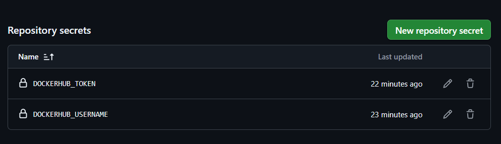
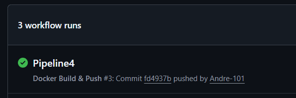
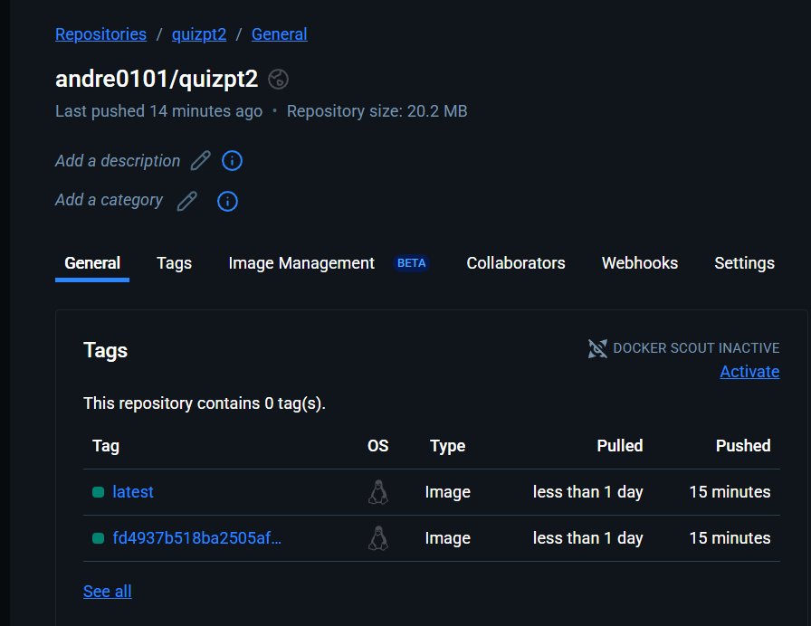

# docker-test-PT2 — Build & Push con GitHub Actions

Proyecto simple para demostrar cómo construir una imagen Docker y publicarla automáticamente en Docker Hub usando GitHub Actions.

## Resultado

**Imagen publicada en Docker Hub:** → `https://hub.docker.com/r/andre0101/quizpt2`

**Tags generados:** latest y el SHA del commit

## Requisitos

1. Cuenta en Docker Hub.
2. En tu fork de GitHub, crear los *Repository secrets*: `DOCKERHUB_USERNAME` (tu usuario) y `DOCKERHUB_TOKEN` (Access Token creado en Docker Hub → Security → New Access Token).

## Flujo del Pipeline

1. **Checkout** del repositorio.
2. **Setup de Buildx** (prepara el builder para Docker).
3. **Login a Docker Hub** usando los *secrets* del repositorio.
4. **Build & Push**: construye la imagen y la publica en `docker.io/andre0101/quizpt2` con las tags indicadas.

## Disparadores

* **Push a `main`**: construye y publica la imagen.

## Evidencias

* **Secrets** 

* **workflow** exitoso

* **Docker Hub**

